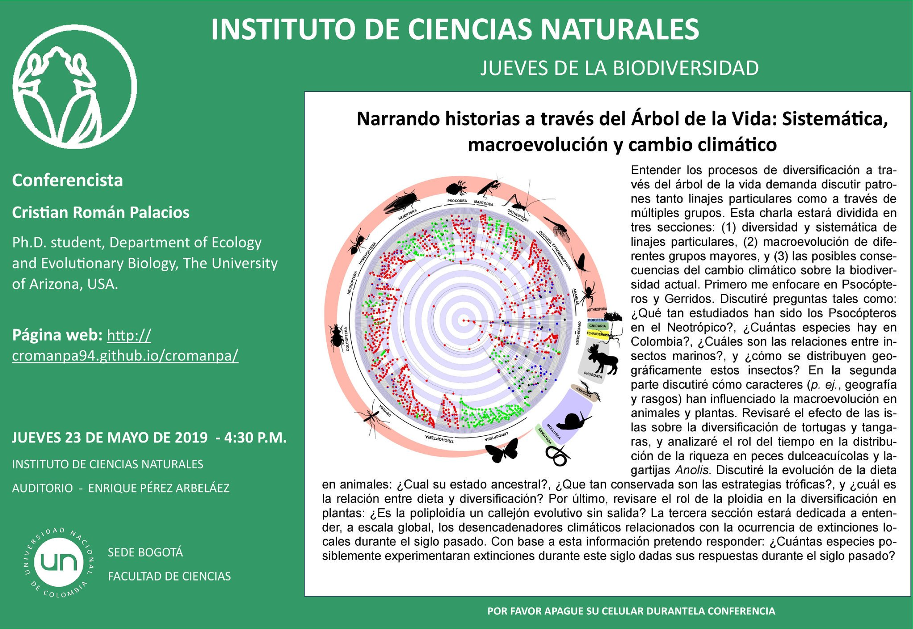

## Universidad Nacional de Colombia, Bogotá (May 2019)

*Narrando historias a través del Árbol de la vida: Sistemática, macroevolución y cambio climatico*

  [**Link to the talk**](https://www.youtube.com/watch?v=lwHcw65gxI0)

  <b>Some Links:</b> 
  <a href="#">Link 1</a> |
  <a href="#">Link 2</a> |
  <a href="#">Link 3</a>
    
  

